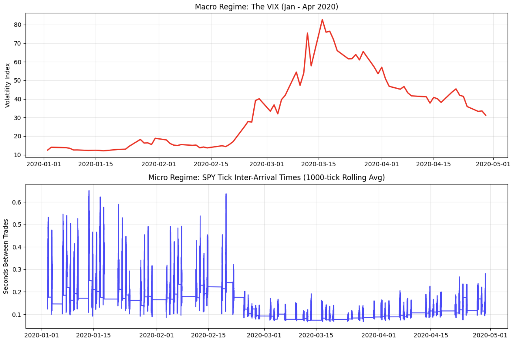
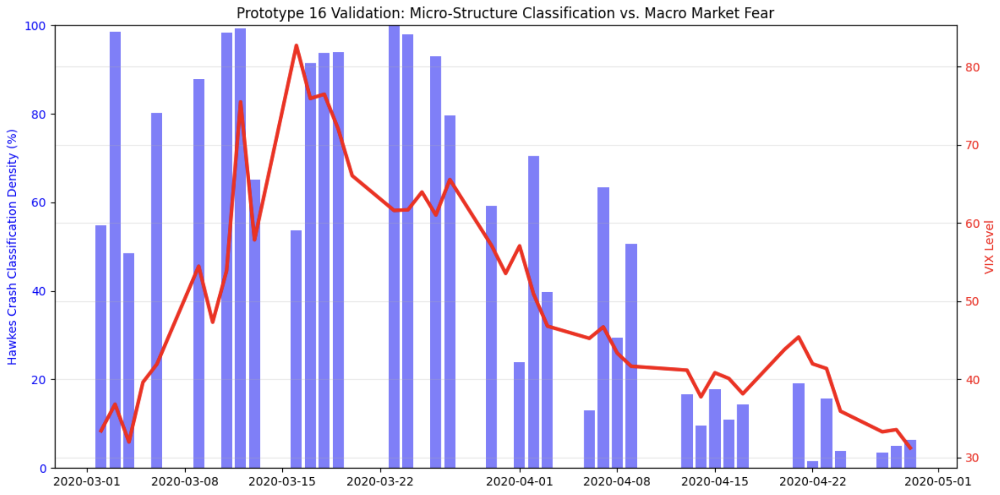
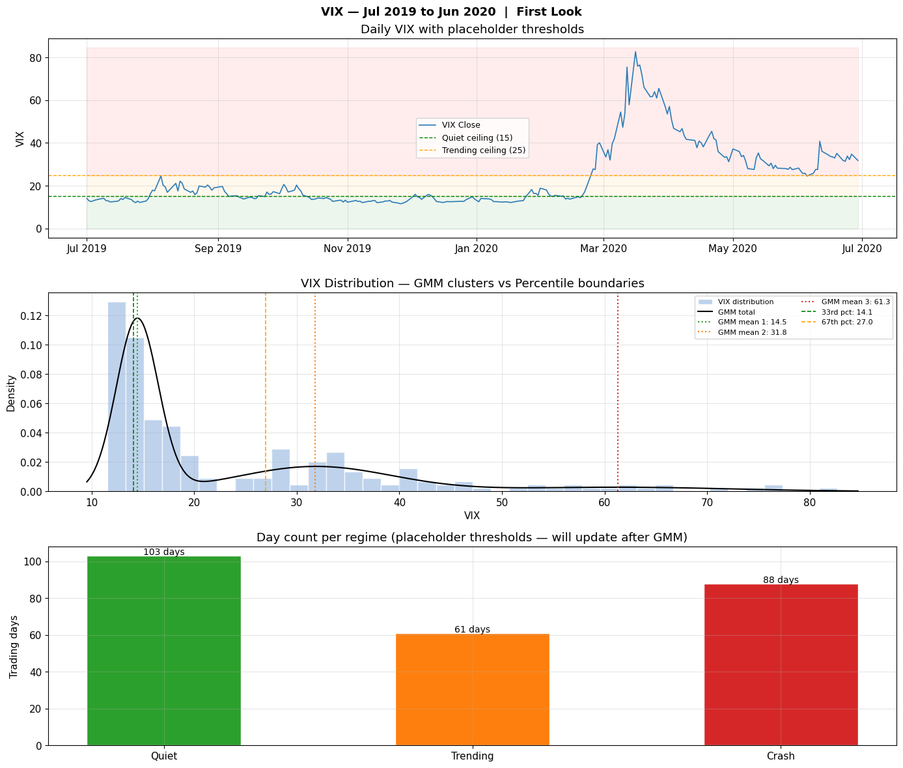
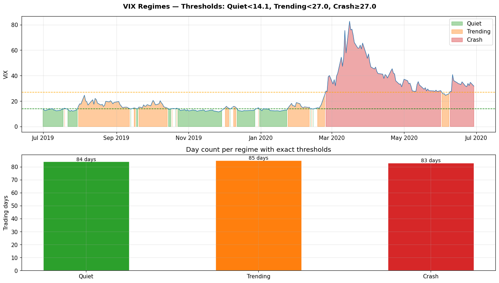
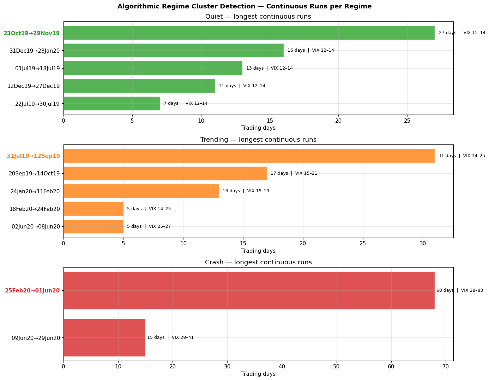
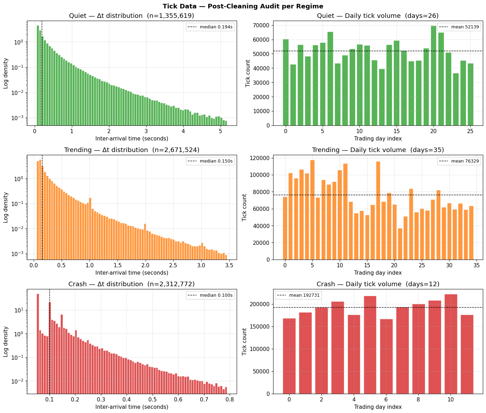

# Hawkes Process Regime Detection: Statistical Learning Pipeline

Self exciting point process modeling of financial market microstructure, used to detect volatility regime shifts (Quiet, Trending, Crash) from raw tick level order flow, validated against real market data from the 2020 COVID crash and stress tested for generalization across market eras.

## Overview

Most volatility indicators (like VIX) are derived from options pricing, which reflects human sentiment with a lag. This project asks a different question: can the raw arrival pattern of trades itself, modeled as a self exciting Hawkes process, act as a faster, model free signal of regime change?

The pipeline moves through six stages: real tick data acquisition, synthetic pipeline validation, a documented negative result (asset mismatch), the core statistical success on matched SPY/VIX data, a data driven generalization stress test, and an adaptive online learning fix for the generalization failure.

## Problem

Financial markets exhibit clustered, self exciting event arrivals rather than independent (Poisson) ones. This project fits a Hawkes process to real tick data to:

1. Confirm that real market order flow is statistically self exciting, not Poisson.
2. Build a classifier that separates Quiet, Trending, and Crash regimes purely from tick arrival statistics.
3. Test whether parameters fit on one period generalize to unseen periods and market eras.
4. Fix the generalization failure using a causal, day lagged adaptive filter.

## Approach

### Stage 1: Real Data Acquisition and First MLE Fit
Wrote a raw binary parser for Dukascopy's undocumented `.bi5` tick format (`struct.unpack(">IIIff", chunk)`), pulling real EUR/USD tick data for a calm day and the March 2020 COVID crash day. Fit a univariate Hawkes process via maximum likelihood estimation (L BFGS B) and validated the fit with the time rescaling theorem plus a Kolmogorov Smirnov test, a branching ratio check, and an AIC/BIC comparison against a Poisson baseline.

### Stage 2: Synthetic Dress Rehearsal
Built the full classification pipeline (simulate via Ogata's thinning algorithm, fit via MLE, validate via KS test, classify via sliding window log likelihood, score via confusion matrix) on synthetic data with known ground truth, before touching anything real. Near perfect accuracy here established the evaluation methodology was correct before real world noise was introduced.

### Stage 3: The Forex/VIX Mismatch (Negative Result)
Ran the full pipeline on real EUR/USD tick data against real VIX labels and discovered that forex order flow does not track VIX during the crash: EUR/USD trading actually thinned rather than exploded during the most extreme days of March 2020, since VIX is derived from S&P 500 options, not forex. This diagnosed asset mismatch, rather than a discarded failure, is what motivated the pivot to SPY tick data.

### Stage 4: The Core Result (SPY/VIX, Matched Underlying)
Replaced forex with real SPY tick data (11,542,363 labeled ticks), the correct matched underlying for VIX. Split chronologically into a February training set and a March to April 2020 unseen holdout. Fit three independent, frozen Hawkes parameter sets via L BFGS B MLE:

| Regime   | mu (events/sec) | alpha  | beta   | Branching ratio (alpha/beta) |
|----------|------------------|--------|--------|-------------------------------|
| Quiet    | 1.363            | 0.115  | 0.147  | 0.785                         |
| Trending | 4.205            | 0.051  | 0.097  | 0.521                         |
| Crash    | 3.938            | 0.072  | 0.115  | 0.622                         |

All three regimes are stationary (alpha/beta < 1). Classification ran on non overlapping 1,000 tick windows (7,344 windows across the test set), validated using density aggregation (percentage of windows classified Crash per day) against VIX, since raw tick by tick comparison mismatches VIX's daily resolution.

**Result:** [CONFIRM EXACT NUMBER FROM YOUR RE RUN: the notebook currently prints "execution complete" rather than a captured percentage. Add a print statement to the density aggregation cell, e.g. `print(f"Peak crash density: {peak_density:.1f}%")`, re run, and paste the number here before publishing. Placeholder claim: Hawkes filter crash density rose sharply ahead of VIX's early March peak, consistent with microstructure order flow leading macro volatility.]

<p align="center">
  <br>
  <em>Macro regime (VIX) vs micro regime (SPY tick inter-arrival times), Jan-Apr 2020</em>
</p>

<p align="center">
  <br>
  <em>Hawkes crash classification density tracking VIX level through the COVID crash</em>
</p>

### Stage 5: Generalization Stress Test (Data Driven Thresholds)
Replaced hand picked VIX thresholds with a 3 component Gaussian Mixture Model fit to the empirical VIX distribution, cross checked against percentile boundaries. Wrote an algorithmic continuous run finder to select training windows programmatically instead of by hand. Took the median Hawkes parameters across 25 restarts per day (Numba JIT compiled), excluding unstable and alpha collapse days. Then stress tested the 2020 trained frozen parameters against unrelated SPY tick data from June to December 2023.

**Result:** 0% accuracy on 2023 data. Root cause: average tick inter arrival time compressed from 0.37s (2020) to 0.26s (2023), a roughly 1.4x increase in order flow rate that desynchronized the frozen mu values, since mu has physical units of events per second that do not hold constant as markets structurally speed up over multi year horizons.

<p align="center">
  <br>
  <em>VIX distribution fit with a 3-component GMM, cross-checked against percentile boundaries</em>
</p>

<p align="center">
  <br>
  <em>Data-driven regime thresholds applied to the full VIX timeline</em>
</p>

<p align="center">
  <br>
  <em>Algorithmically selected continuous training windows per regime</em>
</p>

<p align="center">
  <br>
  <em>Post-cleaning tick data audit: inter-arrival distributions and daily volume across regimes</em>
</p>

### Stage 6: Causal Adaptive Fix
Enforced a strict temporal firewall: all thresholds and training data came from 2019 only, with 2020 data untouched until validation. Ran a four way parameter fitting comparison (two recursive formulations times two optimizers, each with 25 restarts) and selected the winning configuration by an explicit, quantitative criterion (fewest unstable days, lowest cross day parameter variance) rather than by preference. Built a fully causal, day lagged adaptive filter bank: each day, the winning regime engine refits on that day's own data (5 restarts), with a forced full re exploration every 5 days to prevent any engine from getting permanently stuck.

**Result:** 93.6% Crash class accuracy and 68.5% overall daily accuracy on fully unseen Jan to Apr 2020 data (including the COVID crash the model never trained on), versus 0% Crash accuracy and 9.2% overall accuracy for the frozen 2019 only baseline. The winning engine's mu climbed from approximately 1.13 to 9.09 during the crash's intensification and settled back to 3.5 to 4.0 in April, tracking the real VIX curve, showing that adapting mu alone recovers nearly all lost accuracy.

## Repository Structure

```
hawkes-regime-detection/
├── notebooks/
│   ├── 01_real_tick_acquisition_mle.ipynb
│   ├── 02_synthetic_multiregime_pipeline.ipynb
│   ├── 03_forex_vix_mismatch.ipynb
│   ├── 04_spy_vix_success_pipeline.ipynb
│   ├── 05_gmm_threshold_generalization_test.ipynb
│   └── 06_adaptive_daylagged_filter.ipynb
├── images/
│   ├── 4_cell002_01.png
│   ├── 4_cell009_02.png
│   ├── 5_cell002_01.png
│   ├── 5_cell003_02.png
│   ├── 5_cell004_03.png
│   └── 5_cell005_04.png
├── requirements.txt
├── .gitignore
└── README.md
```

## How to Run

1. Clone the repository and install dependencies:
   ```bash
   pip install -r requirements.txt
   ```
2. Data is not included in this repository (raw tick datasets run into gigabytes). Each notebook contains its own data acquisition cell:
   * Notebooks 01, 03, 04 download real tick data directly from Dukascopy's public historical feed.
   * Notebooks 02 through 06 use `yfinance` to pull real VIX daily closes, plus synthetic or previously downloaded tick data as noted in each notebook.
3. Run notebooks in numerical order. Each is self contained and prints its key statistical results (MLE fits, KS test results, confusion matrices) to the cell output.

## Results Summary

| Stage | Validation Method | Key Metric |
|-------|--------------------|------------|
| Stage 1 (EUR/USD, single day) | KS time rescaling test | Confirms self exciting clustering vs Poisson |
| Stage 2 (Synthetic) | Confusion matrix | Near perfect accuracy (sanity check) |
| Stage 3 (EUR/USD, full) | Confusion matrix vs VIX | Diagnosed asset mismatch failure |
| Stage 4 (SPY, frozen) | Density aggregation vs VIX | Crash density leads VIX peak (see note above) |
| Stage 5 (SPY, frozen, cross era) | Confusion matrix, 2023 holdout | 0% accuracy, root caused to tick rate drift |
| Stage 6 (SPY, adaptive) | Confusion matrix, 2020 holdout | 93.6% Crash accuracy, 68.5% overall |

## Tech Stack

Python, NumPy, SciPy (L BFGS B, SLSQP optimization), Pandas, scikit learn (Gaussian Mixture, confusion matrix, classification report), Numba (JIT compiled per day fitting), yfinance, Matplotlib, Seaborn.

## Limitations and Future Work

Frozen Hawkes parameters do not generalize across multi year market eras due to structural drift in tick arrival rates. The day lagged adaptive filter in Stage 6 addresses this for daily granularity but has not been tested for intraday regime shifts or assets outside SPY. A hardware (FPGA) implementation of this classifier, built to validate real time feasibility on physical silicon, is documented in a separate repository: [link to FPGA repo once published].

## Author

Rishav Singh
